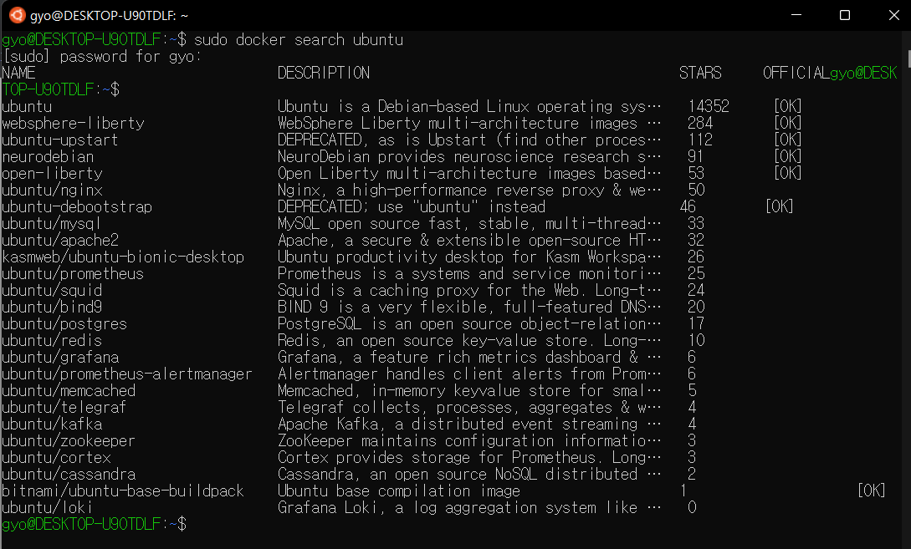

# 도커란?

리눅스의 컨테이너 기술을 이용하여 가상화를 하지 않고 프로세스만 격리해서 빠르게 실행시키는 기술

## 윈도우에 Docker 설치하기 (2022/06/02)

1.  Download Link: https://docs.docker.com/desktop/windows/install

   * 링크에서 다운받기
2.  재부팅후 cmd를 켜서 docker을 쳤을 때 docker 관련 명령어 설명들이 표시되면 설치가 된 것이다.
3.  windows에 설치된 docker hub에서 docker desktop stopped... 라는 메시지가 출력
4.  wsl2 설치 참고: https://docs.microsoft.com/ko-kr/windows/wsl/install-manual

   1. windows에서 **powerShell**을 검색하여 **관리자로 실행** 후 아래 코드들 차례대로 복붙
   2. Linux용 Windows 하위 시스템 사용 : `dism.exe /online /enable-feature /featurename:Microsoft-Windows-Subsystem-Linux /all /norestart`
   3. Virtual Machine 기능 사용 : `dism.exe /online /enable-feature /featurename:VirtualMachinePlatform /all /norestart`
   4. 설치 참고 링크에서 4단계 Linux 커널 업데이트 패키지 다운로드하기
   5. WSL 2를 기본 버전으로 설정 : `wsl --set-default-version 2`
   6. linux 배포 버젼 확인 : `wsl --list --online`
   7. linux 배포판을 아래 명령어로 설치 : `wsl --install -d Ubuntu-20.04`
5.  윈도우 오른쪽 화면 아래에 ^ 표시를 눌러 고래 모양 도커를 우클릭하고 `Switch to Linux containers...` 클릭
6.  windows에 설치된 docker hub에 Docker Desktop starting... 라는 문구가 출력되면 성공!

## Docker 사용해보기

https://www.youtube.com/watch?v=Bhzz9E3xuXY

Docker Desktop을 실행하고 `Switch to Linux containers...` 클릭 후 우분투 실행

우분투에서는 `search` 명령으로 Docker Hub에서 이미지를 검색할 수 있다.

 `sudo docker search ubuntu` 를 입력하면 아래와 같이 나옴

sudo를 입력하지 않아도 관리자 명령을 내릴 수 있도록 유저이름을 등록하는 코드 : `sudo usermod -aG docker 유저이름`

`docker version` 을 입력하여 버전 확인

로그아웃 : `exit` 

도커의 패키지 시스템이 구성된 이미지를 받아오기(패키지 매니저) :  `docker pull ubuntu:20.04`

현재 docker에 깔려있는 이미지 확인 : `docker images`

도커에는 2가지 개념이 있다. 

1. 이미지 : 실행파일과 라이브러리가 조합된 것을 이미지로 만들어 놓은 것
2. 컨테이너 : 이미지를 실행한 상태

컨테이너 안으로 들어가기(가상환경) : `docker run -i -t ubuntu:20.04 /bin/bash`

i : 사용자가 입출력을 할 수 있는 상태

t : 가상 터미널 환경을 에뮬레이션 해주겠다. 이렇게 해야 bash를 띄워서 명령을 입출력 할 수 있게 된다.

에뮬레이션(emulation) : 한 컴퓨터가 다른 컴퓨터처럼 똑같이 작동하도록 소프트웨어나 마이크로 프로그래밍을 사용하는 기법.

/bin/bash 를 주는 이유 : ubuntu:20.04의 /bin/bash를 지정하여 컨테이너 유지를 시키기 위해

`ps ax` : 현재 실행 중인 것을 보여줌

`exit` : /bin/bash를 종료 = 컨테이너 종료 후 빠져나옴

`docker ps` : 프로세스를 볼때 ps명령 / 종료 후 ps를 보면 아무것도 없음

`docker ps -a` : 프로세스의 리스트들이 나오고 실행되고 있거나 종료된 것 모두 나옴 / 컨테이너 이름 볼 수 있음

내 컨테이너 이름은 : inspiring_lamarr

`docker start 컨테이너 이름` : 이름이 한번 더 출력되면 실행된 것 / start는 실행만 하는 명령

`docker attach 컨테이너 이름` : 컨테이너로 들어오는 명령어

ctrl + p + q : 컨테이너를 종료하지 않고 빠져 나오는 단축키(bash의 단축키)

`docker stop 컨테이너 이름` : 컨테이너 밖에서 종료시키는 명령어

`docker rm 컨테이너 이름` : 컨테이너 삭제

